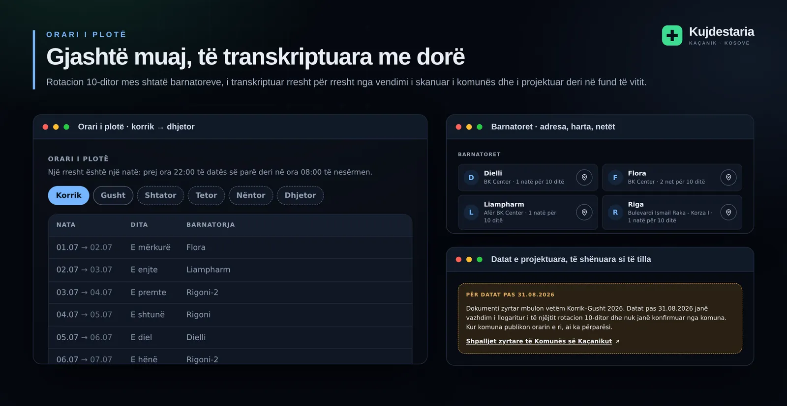
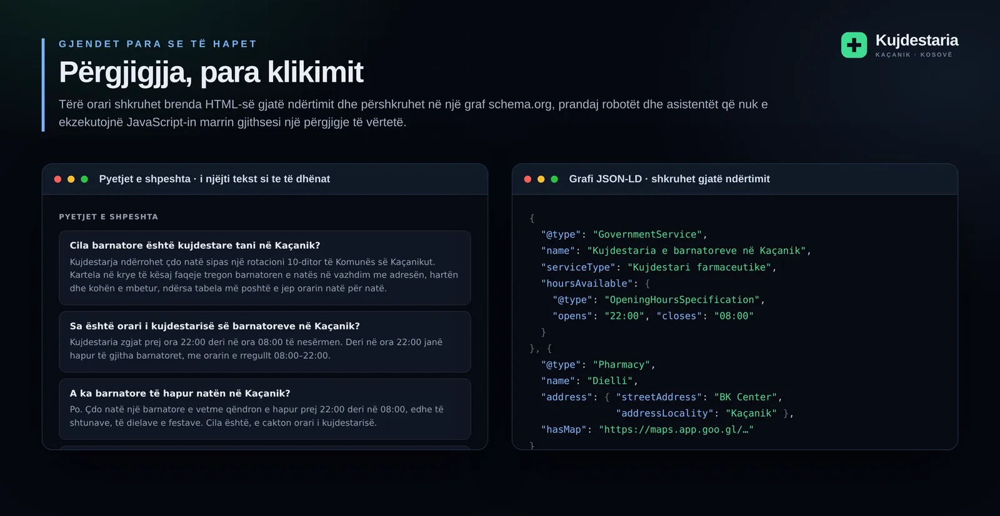

<div align="center">


# Kujdestaria e barnatoreve

**Cila barnatore është e hapur tani në Kaçanik.**

[**kujdestaria.rilindkycyku.dev →**](https://kujdestaria.rilindkycyku.dev)

</div>

---

Prej ora 22:00 deri në 08:00 një barnatore e Komunës së Kaçanikut qëndron e hapur me radhë,
sipas një rotacioni 10-ditor. Orari ekziston — si PDF i skanuar te shpalljet e komunës.
Kjo faqe e kthen atë PDF në një përgjigje: emri i barnatores kujdestare si elementi më i madh
në ekran, sa i ka mbetur kujdestarisë, dhe një buton që e hap në Google Maps. Instalohet në
ekranin kryesor dhe punon pa internet — sepse ora kur duhet është edhe ora kur lidhja është
më e dobët.

| | |
| --- | --- |
| **Ndërtimi** | Vite — pa framework për ndërfaqen |
| **Periudha** | 01.07.2026 – 31.12.2026, zyrtare deri më 31.08.2026 |
| **Barnatoret** | 7, në rotacion 10-ditor |
| **Pa internet** | Po — PWA me service worker, orari brenda paketës |
| **Tema** | sipas sistemit, ose e zgjedhur vetë — e çelët / e errët |
| **Fonti** | Quicksand, brenda paketës — pa Google Fonts, punon pa internet |
| **Provat** | `node --test`, pa framework provash |

| | |
| :-- | :-- |
|  |  |
| Jeshile natën me kohën e mbetur, e kaltër ditën me kohën deri sa të fillojë. | Gjashtë muaj, barnatoret me adresa, datat e projektuara të shënuara. |
|  |  |
| Faqja hapet me rrjetin e fikur; instalimi ka udhëzime sipas platformës. | Orari brenda HTML-së dhe grafi JSON-LD, të shkruara gjatë ndërtimit. |

## Nisja e shpejtë

```bash
npm install
npm run dev       # serveri i zhvillimit
npm run build     # ndërton në dist/, mbush HTML-në dhe përgatit sw.js
npm test          # provat e kohës, të të dhënave dhe të SEO-s
npm run gjenero   # rigjeneron src/data/orari-2026.json
npm run ikonat    # rigjeneron ikonat dhe imazhin e ndarjes te public/
```

Pas `npm run build` faqja është statike — `dist/` mund të vendoset kudo.

## Struktura

```
src/
  main.js                pikënisja në shfletues — ngjarjet dhe tiku i minutës
  faqja.js               markup-i, i përbashkët me parandërtimin (pa DOM, pa Date)
  koha.js                logjika e kohës — e ndarë që të provohet pa bundler
  orari.js               kush është kujdestare, netët në vijim, kontaktet
  skema.js               grafi schema.org (JSON-LD)
  veprimet.js            ndarja, instalimi, service worker-i
  harta.js               validimi i lidhjeve të Google Maps
  ikonat.js              ikonat SVG inline
  data/orari-2026.json   orari i gjeneruar
  fonts/                 Quicksand (woff2 variabël) dhe licenca OFL

scripts/
  gjenero-orarin.mjs     ndërton orarin nga rotacioni dhe datat e dokumentit
  parafaqja.mjs          faqja e gatshme, head-i, robots.txt dhe sitemap.xml
  pergatit-sw.mjs        lista e paracache-it te sw.js, pas ndërtimit
  gjenero-ikonat.mjs     ikonat PNG dhe imazhi i ndarjes

public/
  tema.js                tema e zgjedhur — bllokuese te <head>-i, para vizatimit
  sw.js                  service worker-i; paracache-i shkruhet gjatë ndërtimit
```

## Orari

| | Orari | Kush |
| --- | --- | --- |
| **I rregullt** | 08:00–22:00 | të gjitha barnatoret |
| **Kujdestaria** | 22:00–08:00 | vetëm barnatorja kujdestare e asaj date |

Rotacioni 10-ditor: Flora, Liampharm, Rigoni-2, Rigoni, Dielli, Rigoni-2, Rigoni, Riga,
Riga-2, Flora. Barnatorja e caktuar për një datë rri e hapur **prej 22:00 të asaj date deri
në 08:00 të nesërmen** — prandaj pas mesnate kujdestare është ende barnatorja e datës së
kaluar.

Të dhënat janë te [`src/data/orari-2026.json`](src/data/orari-2026.json), i gjeneruar nga
[`scripts/gjenero-orarin.mjs`](scripts/gjenero-orarin.mjs). Dokumenti zyrtar mbulon vetëm
korrik–gusht 2026; pjesa tjetër e vitit është i njëjti rotacion i vazhduar me llogaritje,
me `"zyrtare": false` dhe i shënuar **„e projektuar"** në faqe.

## Vendimet

Arsyetimi pas zgjidhjeve — pse kartela rifreskohet sipas pjesëve, pse shiriti vizatohet me
SVG nën një CSP pa `unsafe-inline`, pse orari shkruhet brenda HTML-së, çka mbulojnë provat,
si punon paracache-i dhe si vendoset në Vercel — është te [**docs/vendimet.md**](docs/vendimet.md).

## A ka gabim në orar?

Orari është transkriptuar me dorë nga një skanim pa shtresë teksti, dhe rotacioni pas
31.08.2026 është i llogaritur — prandaj një datë e shkëmbyer është e mundshme.

- Nëse e vëreni një gabim, shkruani te [kontaktet](https://www.rilindkycyku.dev/contacts)
  ose hapni një *issue*. Fundfaqja e faqes e ka të njëjtën lidhje, që të mos duhet GitHub-i.
- Kur komuna publikon orarin e ri te [shpalljet][shpalljet], përditësohen `ROTACIONI`,
  `FILLIMI`, `FUNDI_ZYRTAR` dhe `FUNDI` te
  [`scripts/gjenero-orarin.mjs`](scripts/gjenero-orarin.mjs), pastaj `npm run gjenero`.
  Provat e kapin një gjenerim të gabuar para se ta kapë faqja.

Burimi zyrtar është njoftimi `03Nr. 500/01-15606/26` i datës 29.06.2026 i Komunës së
Kaçanikut — [PDF-ja e skanuar][pdf].

[pdf]: https://kacanik.rks-gov.net/wp-content/uploads/2026/06/Orari-Korrik-Gusht-2026.pdf
[shpalljet]: https://kacanik.rks-gov.net/shpalljet/
